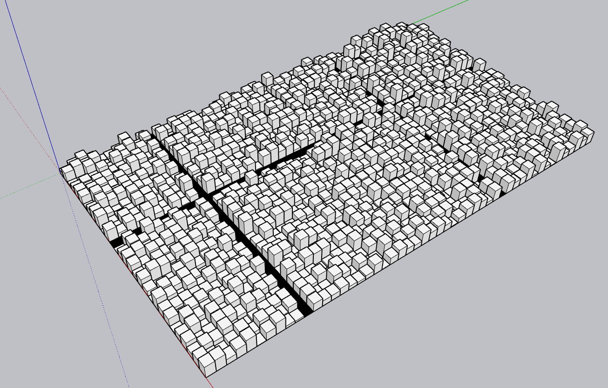

# Ruby code snippet to generate a random cityscape in 3D design tool Sketchup

This is a simple example for creating a grid of block with random height. Three roads are defined with blocks of limited height and black color.

   

## How to run
The file is not packaged as a Sketchup extention (.rbz). You need to copy the content of the cubes.rb file into a Ruby editor and run the code.
